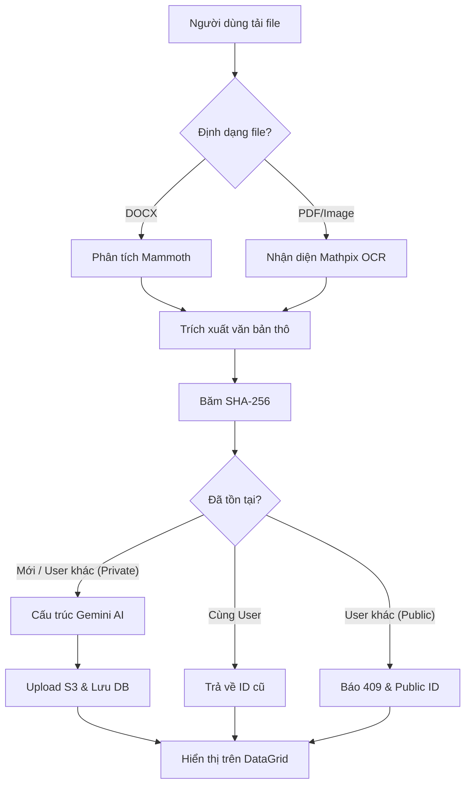

# 🏗️ Kiến trúc hệ thống (Architecture)

Tài liệu này mô tả kiến trúc cấp cao, danh mục công nghệ và luồng dữ liệu của dự án **Project Question Bank**.

## 📋 Tổng quan (Overview)

Project Question Bank là một nền tảng giáo dục hỗ trợ bởi AI, được thiết kế để tự động hóa quy trình trích xuất, cấu trúc hóa và quản lý các câu hỏi Toán học từ nhiều định dạng tài liệu khác nhau (PDF, Ảnh).

---

## 🛠️ Danh mục công nghệ (Tech Stack)

| Tầng / Layer | Công nghệ / Technology | Lý do chọn lựa / Rationale |
| :--- | :--- | :--- |
| **Giao diện (Frontend)** | Next.js 16, React 19 | Hiệu suất cao, App Router tối ưu hóa cho SEO và điều hướng. |
| **Định dạng (Styling)** | Tailwind CSS 4, Framer Motion | CSS linh hoạt, hỗ trợ tốt cho các chuyển động mượt mà. |
| **Render Toán học** | KaTeX | Tốc độ render cực nhanh, hỗ trợ tốt cho các công thức LaTeX phức tạp. |
| **Máy chủ (Backend)** | Next.js API Routes, Server Actions | Hợp nhất mã nguồn, thực thi phía server với độ trễ tối thiểu. |
| **Cơ sở dữ liệu (DB)** | MySQL | Lưu trữ quan hệ mạnh mẽ, tin cậy cho dữ liệu có cấu trúc. |
| **Xử lý AI** | Google Gemini 1.5/2.0 | Khả năng lập luận cao, hiểu biết sâu về ký pháp toán học. |
| **OCR / Parsing** | Mathpix API, Mammoth | Chuyên biệt cho việc trích xuất LaTeX và phân tích file Word. |

---

## 🔄 Luồng dữ liệu (Data Flow)

Sơ đồ dưới đây minh họa quy trình một tài liệu được xử lý từ lúc tải lên đến khi lưu vào cơ sở dữ liệu.

### Các bước quan trọng trong Workflow:
1.  **Tiếp nhận (Ingestion)**: File được nhận qua chuẩn `multipart/form-data` tại endpoint `/api/convert` hoặc `/api/documentcustom/upload-and-save`.
2.  **Chống trùng (Deduplication)**: Hash file bằng SHA-256. Hệ thống áp dụng chiến lược **Ownership-Separated Deduplication** tùy thuộc luồng xử lý:
    - *Với luồng AI Ingestion*: Chặn tải lên lại file Public; tiếp tục upload độc lập với file Private của user khác.
    - *Với luồng Document Custom*: Reuse link S3 của file cũ, chỉ tạo bản ghi DB sao chép độc lập để tối ưu dung lượng.
3.  **Bóc tách (Parsing)**: Sử dụng Mathpix đặc biệt để đảm bảo độ chính xác cao cho các biểu thức Toán học LaTeX.
4.  **Trí tuệ nhân tạo (AI Intelligence)**: Gemini cấu trúc hóa chuỗi thô thành đối tượng JSON chứa câu hỏi, phương án và metadata.
5.  **Lưu trữ (Storage)**: 
    - **Database**: Lưu trữ quan hệ trong MySQL cho metadata và questions.
    - **Filesystem**: Lưu trữ file nhị phân raw trên **AWS S3** giúp hệ thống mở rộng linh hoạt.
6.  **Hiển thị (Rendering)**: Sử dụng KaTeX để chuyển đổi các chuỗi LaTeX thành biểu thức toán học trực quan trên giao diện người dùng.

---
*Cập nhật gần nhất: Tháng 4/2026. Biên soạn bởi eMon.*
