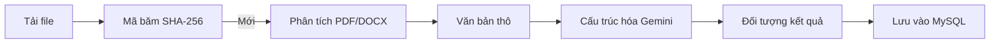

# 🧠 AI Ingestion & Math OCR

Tài liệu chi tiết về hệ thống nạp tài liệu và trích xuất câu hỏi dựa trên AI (Mathpix & Gemini).

---

## 🛠️ Các thành phần cốt lõi (Core Components)

1. **Mathpix API**: Xử lý OCR hoàn hảo cho hình ảnh và PDF có chứa các công thức Toán học phức tạp, hỗ trợ đầu ra LaTeX.
2. **Mammoth**: Thư viện dùng để lấy văn bản thô từ các định dạng file Word (.docx) một cách nhanh chóng.
3. **QuestionParserService (Gemini 2.5 Flash)**: Mô hình ngôn ngữ lớn (LLM) chuyên biệt dùng để cấu trúc hóa chuỗi thô thành định dạng câu hỏi (JSON) bao gồm câu hỏi, phương án, đáp án và lời giải.

---

## 🔄 Luồng xử lý nạp liệu (Ingestion Pipeline)

Sơ đồ tóm tắt quy trình xử lý:

### 1. Kiểm tra trùng lặp (Deduplication)
Khi file được tải lên, hệ thống sẽ tạo mã băm SHA-256 của file nhị phân. Cơ chế xử lý trùng lặp phụ thuộc vào đối tượng sở hữu:

- **Trùng lặp cá nhân (Personal Duplicate)**: Nếu user hiện tại đã tải file này lên trước đó, API `check-duplicate` sẽ báo trùng và ngăn chặn việc tạo thêm dữ liệu rác.
- **Trùng lặp hệ thống (Global Deduplication)**: Nếu file đã được tải lên bởi một user khác:
    - Hệ thống **không** tải file vật lý mới lên AWS S3 (Tiết kiệm tài nguyên).
    - Hệ thống tự động tạo một bản ghi Document mới cho user hiện tại trong Database.
    - Bản ghi mới trỏ về cùng nội dung văn bản (content) và đường dẫn S3 (`link_s3`) của file gốc.
    - Các câu hỏi đã được trích xuất trước đó sẽ được "link" sang Document mới của user hiện tại.

*Lợi ích: Mỗi user vẫn thấy tài liệu trong thư viện riêng của mình, trong khi dung lượng lưu trữ S3 chỉ tốn cho 1 bản copy duy nhất.*

### 2. Trích xuất văn bản (Parsing)
- **PDF/Ảnh**: Được gửi trực tiếp lên Mathpix API.
- **Văn bản**: OCR thô được chuyển thành LaTeX và hiển thị tức thì qua công cụ **KaTeX** trên giao diện để người dùng kiểm tra trước khi lưu.

---
*Truy cập `docs/features/ai-classification.md` để xem cách Gemini phân loại câu hỏi.*
- Biểu thức Toán học: Các công thức được bao quanh bởi ký tự `$` hoặc `$$` để hiển thị đúng định dạng LaTeX trên giao diện.

### 3. Cấu trúc hóa bằng AI (Gemini AI)
Gemini nhận văn bản thô và được cung cấp prompt để tạo ra một đối tượng JSON chứa:
- `statement`: Nội dung câu hỏi.
- `options`: Danh sách các phương án lựa chọn (A, B, C, D).
- `weight`: Trọng số (1 cho đáp án đúng, 0 cho đáp án sai).
- `hint`: Gợi ý hoặc lời giải chi tiết.

---
*Truy cập `docs/features/question-management.md` để xem tính năng người dùng.*
