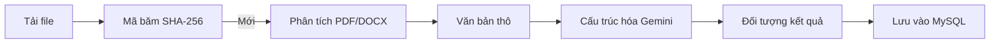

# 🧠 AI Ingestion & Math OCR

Tài liệu chi tiết về hệ thống nạp tài liệu và trích xuất câu hỏi dựa trên AI (Mathpix & Gemini).

---

## 🛠️ Các thành phần cốt lõi (Core Components)

1. **Mathpix API**: Xử lý OCR hoàn hảo cho hình ảnh và PDF có chứa các công thức Toán học phức tạp, hỗ trợ đầu ra LaTeX.
2. **Mammoth**: Thư viện dùng để lấy văn bản thô từ các định dạng file Word (.docx) một cách nhanh chóng.
3. **QuestionParserService (Gemini 2.5 Flash)**: Mô hình ngôn ngữ lớn (LLM) chuyên biệt dùng để cấu trúc hóa chuỗi thô thành định dạng câu hỏi (JSON) bao gồm câu hỏi, phương án, đáp án và lời giải.

---

## 🔄 Luồng xử lý nạp liệu (Ingestion Pipeline)

Sơ đồ tóm tắt quy trình xử lý:

### 1. Kiểm tra trùng lặp (Deduplication)
Khi file được tải lên, hệ thống sẽ tạo mã băm SHA-256. Nếu mã băm này đã tồn tại trong trạng thái `COMPLETED`, tài liệu sẽ được coi là đã xử lý và trả về phiên bản cũ.

### 2. Trích xuất văn bản (Parsing)
- **PDF/Ảnh**: Được gửi trực tiếp lên Mathpix API.
- **Word (.docx)**: Được xử lý cục bộ bằng Mammoth.
- Biểu thức Toán học: Các công thức được bao quanh bởi ký tự `$` hoặc `$$` để hiển thị đúng định dạng LaTeX trên giao diện.

### 3. Cấu trúc hóa bằng AI (Gemini AI)
Gemini nhận văn bản thô và được cung cấp prompt để tạo ra một đối tượng JSON chứa:
- `statement`: Nội dung câu hỏi.
- `options`: Danh sách các phương án lựa chọn (A, B, C, D).
- `weight`: Trọng số (1 cho đáp án đúng, 0 cho đáp án sai).
- `hint`: Gợi ý hoặc lời giải chi tiết.

---
*Truy cập `docs/features/question-management.md` để xem tính năng người dùng.*
