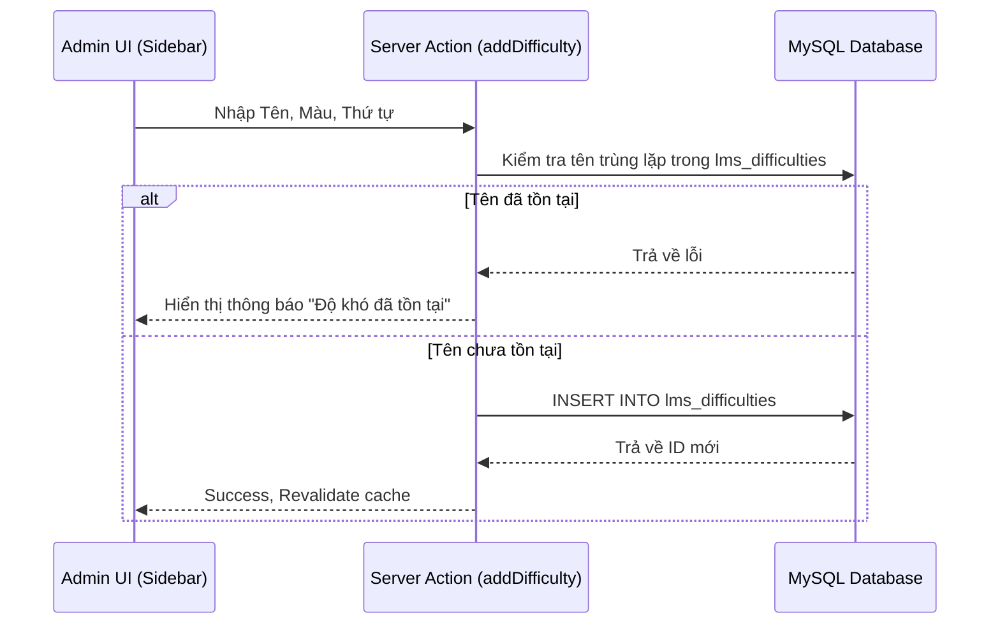

# ⚙️ Cấu hình Độ khó Câu hỏi Động (Dynamic Difficulty Configuration)

Tài liệu này đặc tả chi tiết về tính năng cấu hình mức độ khó linh động dành cho Quản trị viên (Admin) trong hệ thống Ngân hàng Câu hỏi VietElite. Tính năng cho phép thêm, sửa, xóa các nhãn độ khó và tự động đồng bộ hóa trên toàn bộ câu hỏi liên quan trong hệ thống.

---

## 🗄️ 1. Cơ sở dữ liệu (Database Schema)

Để chuyển đổi từ cơ chế cấu hình độ khó cứng (Dễ, Trung Bình, Khó) sang cơ chế linh động, hệ thống sử dụng một bảng cấu hình mới và cơ chế ánh xạ liên kết.

### A. Bảng cấu hình mới: `lms_difficulties`
Lưu trữ danh sách các mức độ khó được định nghĩa bởi Admin:
*   `id` (INT, Primary Key, Auto Increment): ID định danh duy nhất của mức độ khó.
*   `name` (VARCHAR(50), Unique, Not Null): Tên hiển thị của độ khó (ví dụ: `Dễ`, `Trung Bình`, `Khó`, `Rất Khó`).
*   `color_code` (VARCHAR(7), Not Null): Mã màu hex đại diện cho độ khó, dùng để render Badge màu sắc trên UI (ví dụ: `#22c55e`).
*   `display_order` (INT, Default 0): Thứ tự hiển thị tăng dần trên các dropdown/bộ lọc của hệ thống.
*   `created_at` & `updated_at` (TIMESTAMP): Timestamps ghi nhận thời gian tạo và cập nhật.

### B. Liên kết với bảng Câu hỏi: `lms_questions`
*   Thay vì lưu ID số, trường `question_difficulty` (VARCHAR) trong bảng `lms_questions` lưu **Tên độ khó** (`lms_difficulties.name`) để đảm bảo tính tương thích ngược với dữ liệu cũ và giúp câu hỏi hoạt động độc lập ngay cả khi bảng cấu hình thay đổi.
*   Khi sửa tên độ khó trong bảng cấu hình, một tiến trình trigger đồng bộ SQL sẽ được kích hoạt để đổi tên tất cả câu hỏi tương ứng.

---

## 🔄 2. Luồng chạy tính năng (Execution & Data Flow)

### A. Luồng Thêm mới Độ khó


### B. Luồng Cập nhật & Đồng bộ Câu hỏi
Khi sửa đổi tên của một độ khó (ví dụ từ `Khó` thành `Nâng cao`), hệ thống cần đảm bảo các câu hỏi đang gắn nhãn cũ không bị mất nhãn:
1.  Admin thực hiện chỉnh sửa tên và màu trong Modal.
2.  Server Action `updateDifficulty` nhận thông tin, thực hiện transaction:
    *   **Bước 1**: Cập nhật thông tin trong bảng cấu hình `lms_difficulties`.
    *   **Bước 2**: Thực hiện câu lệnh cập nhật hàng loạt trên bảng câu hỏi:
        ```sql
        UPDATE lms_questions SET question_difficulty = ? WHERE question_difficulty = ?
        ```
3.  Hệ thống gọi `revalidatePath` để làm mới cache hiển thị.

### C. Luồng Xóa & Chuyển đổi Câu hỏi (Migration on Delete)
Để tránh hiện tượng câu hỏi bị mồ côi (không thuộc mức độ khó nào) khi xóa một mức độ khó đang được sử dụng:
1.  Khi Admin nhấn Xóa, Modal yêu cầu chọn một **Độ khó thay thế** (replacement difficulty).
2.  Server Action `deleteDifficulty` nhận ID cần xóa và tên độ khó thay thế.
3.  Transaction trong DB:
    *   **Bước 1**: Tìm và cập nhật tất cả câu hỏi thuộc độ khó sắp xóa sang độ khó thay thế:
        ```sql
        UPDATE lms_questions SET question_difficulty = ? WHERE question_difficulty = ?
        ```
    *   **Bước 2**: Xóa bản ghi cấu hình trong bảng `lms_difficulties`.

---

## 🔌 3. API & Server Actions (`src/actions/difficulty.ts`)

Toàn bộ logic tương tác với DB được đóng gói thông qua các **Server Actions** an toàn:

*   **`getDifficulties()`**:
    *   *Mục đích*: Lấy danh sách toàn bộ các mức độ khó.
    *   *Truy vấn*: `SELECT * FROM lms_difficulties ORDER BY display_order ASC`.
*   **`addDifficulty(name, colorCode, displayOrder)`**:
    *   *Mục đích*: Thêm mới cấu hình độ khó.
    *   *Bảo mật*: Kiểm tra quyền Admin của session. Kiểm tra trùng lặp tên.
*   **`updateDifficulty(id, oldName, newName, colorCode, displayOrder)`**:
    *   *Mục đích*: Cập nhật thông tin độ khó và đồng bộ tên độ khó trong bảng câu hỏi.
*   **`deleteDifficulty(id, name, replacementName)`**:
    *   *Mục đích*: Xóa cấu hình độ khó sau khi di chuyển các câu hỏi liên quan sang độ khó mới.

---

## 🎨 4. Giao diện & Component (UI Components)

### A. Vị trí hiển thị & Kiểm tra phân quyền (Sidebar)
*   Nút kích hoạt **"Cấu hình độ khó"** cùng icon `⚙️ Settings` được tích hợp cố định ở phần chân của thanh **Sidebar** trái.
*   Menu này được bảo vệ bởi logic kiểm tra quyền Admin:
    ```typescript
    const isAdmin = typeof user?.level_rank === 'number' && (user.level_rank === 0 || user.level_rank >= 5);
    ```
    *Chỉ hiển thị nút bấm này đối với tài khoản quản trị.*

### B. Cấu trúc Component Hierarchy
```text
LayoutWrapper (Server Component - Lấy user hiện tại)
 └── Sidebar (Client Component - Nhận prop user)
      ├── Link (Các tab trang: Dashboard, Question Bank, Documents)
      ├── Button "Cấu hình độ khó" (Chỉ hiển thị cho Admin)
      └── DifficultyConfigModal (Modal quản lý cấu hình)
           ├── Nút "Thêm độ khó" (Mở Form nhập mới)
           └── Danh sách dòng độ khó (Hiển thị màu badge, Thứ tự)
                ├── Button Edit (Mở Form cập nhật)
                └── Button Delete (Mở Dialog chọn Độ khó thay thế)
```

### C. Các Component chính:
1.  **`Sidebar.tsx`**: Nhận `user` từ server layout, quản lý state đóng/mở Modal và lưu trữ danh sách độ khó tạm thời để truyền xuống Modal.
2.  **`DifficultyConfigModal.tsx`**:
    *   Render popup mờ (overlay) đè lên giao diện chính.
    *   Hiển thị danh sách các mức độ hiện thời kèm theo badge màu tương ứng (`color_code`).
    *   Chứa form nhập/sửa tên, màu (sử dụng HTML5 color picker trực quan), thứ tự sắp xếp.
    *   Hiển thị dropdown lựa chọn thay thế khi người dùng click vào icon Xóa (Thùng rác).

---

## 🔒 5. Phân quyền & Bảo mật (Security & Access Control)

1.  **Client-Side Gatekeeping**: Nút mở Modal cấu hình độ khó bị ẩn hoàn toàn đối với giáo viên hoặc học sinh thông thường trên Sidebar.
2.  **Server-Side Verification**: Trong tất cả các Server Actions ghi dữ liệu (`addDifficulty`, `updateDifficulty`, `deleteDifficulty`), hệ thống sử dụng helper `isUserAdmin()` kiểm tra session từ cookie để ngăn chặn tuyệt đối trường hợp người dùng thông thường gửi request sửa đổi dữ liệu qua API client.
3.  **Virtualize Level Rank**: Người dùng SSO có `level_rank = 0` (Super Admin) được ánh xạ ảo sang mức `5` trong `getCurrentUser()` để đảm bảo quyền truy cập không bị gián đoạn và đồng bộ trên toàn hệ thống.
