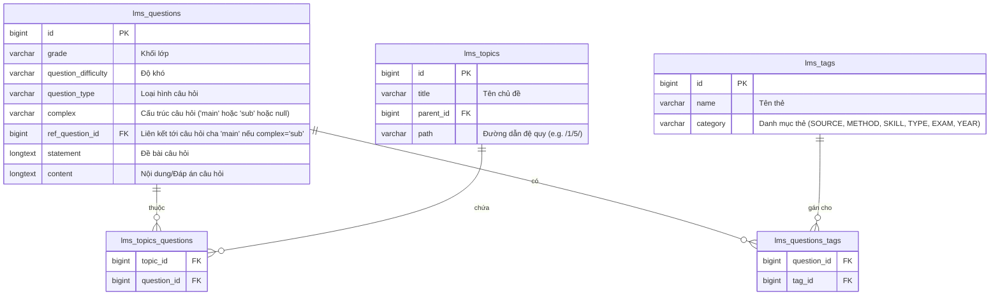

# Data Model: Bộ Tiêu chí Phân loại và Bộ lọc Ngân hàng Câu hỏi

Không cần tạo thêm bảng hoặc trường mới trong cơ sở dữ liệu. Thiết kế này tận dụng 100% cấu trúc cơ sở dữ liệu hiện có để đảm bảo tính tương thích và hiệu năng cao.

## 1. Bản đồ quan hệ thực thể (ERD Logical Mapping)



*Lưu ý: Bộ sách giáo khoa (textbook) không cần tạo trường hay bảng phân loại vì từ năm học 2026-2027 toàn quốc dùng chung một bộ sách giáo khoa.*

## 2. Đặc tả Logic Truy vấn (Query Specifications)

### A. Lọc theo Khối lớp (Grade) và Độ khó (Difficulty)
Truy vấn trực tiếp trên bảng `lms_questions`:
```typescript
if (grades && grades.length > 0) {
  whereClause.grade = { in: grades.map(Number) };
}
if (difficulties && difficulties.length > 0) {
  whereClause.question_difficulty = { in: difficulties };
}
```

### B. Lọc đệ quy theo Chủ đề học thuật (lms_topics)
1. Truy vấn chủ đề hiện tại lấy `path`.
2. Tìm tất cả chủ đề con cháu có `path` bắt đầu bằng `path` cha.
3. Thực hiện truy vấn giao với `lms_topics_questions`.

### C. Lọc theo nhiều Thẻ Tag (lms_tags)
Lọc theo kiểu **OR** hoặc **AND**:
- Gom nhóm theo Category (ví dụ: SOURCE, METHOD, SKILL, TYPE, EXAM, YEAR).
- Các tag trong cùng một Category sẽ được lọc theo điều kiện **OR** (hợp).
- Giữa các Category khác nhau sẽ được lọc theo điều kiện **AND** (giao).
```typescript
// Lọc các tag theo category
const categoryFilters = Object.entries(tagsByCategory).map(([category, tagIds]) => {
  return {
    tags: {
      some: {
        tag_id: { in: tagIds.map(BigInt) }
      }
    }
  };
});

if (categoryFilters.length > 0) {
  whereClause.AND = categoryFilters;
}
```

### D. Cấu trúc câu hỏi chùm (complex/sub)
- Giao diện danh sách Ngân hàng Câu hỏi chỉ hiển thị câu hỏi độc lập (`complex` khác `main` và `sub`, hoặc null/empty) và câu hỏi cha (`complex = 'main'`).
- Khi trả về kết quả câu hỏi `main`, hệ thống sẽ tự động truy vấn thêm các câu hỏi con có `ref_question_id` trỏ tới ID của câu hỏi `main` đó và sắp xếp chúng.
- Truy vấn lấy câu hỏi chính:
```typescript
whereClause.OR = [
  { complex: { notIn: ['main', 'sub'] } },
  { complex: null },
  { complex: 'main' }
];
```
