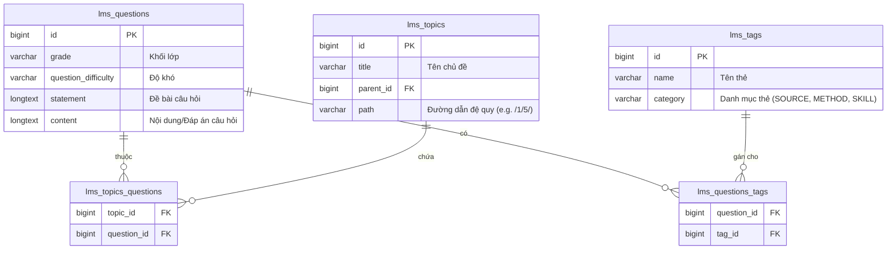

# Data Model: Bộ Tiêu chí Phân loại và Bộ lọc Ngân hàng Câu hỏi

Không cần tạo thêm bảng hoặc trường mới trong cơ sở dữ liệu. Thiết kế này tận dụng 100% cấu trúc cơ sở dữ liệu hiện có để đảm bảo tính tương thích và hiệu năng cao.

## 1. Bản đồ quan hệ thực thể (ERD Logical Mapping)



## 2. Đặc tả Logic Truy vấn (Query Specifications)

### A. Lọc theo Khối lớp (Grade) và Độ khó (Difficulty)
Truy vấn trực tiếp trên bảng `lms_questions`:
```typescript
if (grade) {
  whereClause.grade = Number(grade);
}
if (difficulty) {
  whereClause.question_difficulty = difficulty;
}
```

### B. Lọc đệ quy theo Chủ đề học thuật (lms_topics)
1. Truy vấn chủ đề hiện tại lấy `path`.
2. Tìm tất cả chủ đề con cháu có `path` bắt đầu bằng `path` cha.
3. Thực hiện truy vấn giao với `lms_topics_questions`.

### C. Lọc theo nhiều Thẻ Tag (lms_tags)
Lọc theo kiểu **OR** hoặc **AND**:
- Lọc câu hỏi có chứa ít nhất một trong các tag được chọn:
```typescript
if (tagIds && tagIds.length > 0) {
  whereClause.tags = {
    some: {
      tag_id: { in: tagIds.map(BigInt) }
    }
  };
}
```
