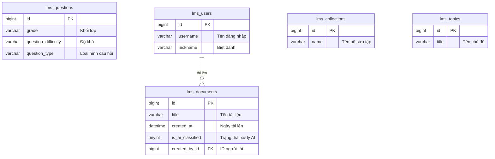

# Data Model: Trang Dashboard Thống kê Cơ bản

Thiết kế này tận dụng 100% cấu trúc cơ sở dữ liệu hiện có để tổng hợp và hiển thị các số liệu thống kê. Không cần tạo thêm bảng hoặc trường mới trong cơ sở dữ liệu.

## 1. Bản đồ quan hệ thực thể (ERD Logical Mapping)



---

## 2. Đặc tả Logic Truy vấn (Query Specifications)

### A. Đếm tổng quan các thực thể chính (KPI Cards)
Truy vấn chạy song song qua Prisma Client:
```typescript
const [questionCount, documentCount, collectionCount, topicCount] = await Promise.all([
  prisma.lms_questions.count(),
  prisma.lms_documents.count(),
  prisma.lms_collections.count(),
  prisma.lms_topics.count()
]);
```

### B. Thống kê theo Khối lớp (Grade)
Nhóm các câu hỏi theo khối lớp:
```typescript
prisma.lms_questions.groupBy({
  by: ['grade'],
  _count: { id: true }
});
```
*Logic định dạng*:
- Nếu `grade` khác `null` và `grade > 0` $\rightarrow$ hiển thị `"Lớp X"`.
- Ngược lại $\rightarrow$ hiển thị `"Khác"`.

### C. Thống kê theo Độ khó (Difficulty)
Nhóm các câu hỏi theo độ khó:
```typescript
prisma.lms_questions.groupBy({
  by: ['question_difficulty'],
  _count: { id: true }
});
```
*Logic ánh xạ chuỗi độ khó lịch sử*:
- `'cb'` $\rightarrow$ `"Cơ bản"`
- `'nc'` $\rightarrow$ `"Nâng cao"`
- `'c'`, `'chuyenso'` $\rightarrow$ `"Chuyên sâu"`
- `null` hoặc rỗng $\rightarrow$ `"Chưa phân loại"`
- Các giá trị khác như `'Dễ'`, `'Trung Bình'`, `'Khó'` giữ nguyên.

### D. Thống kê theo Loại câu hỏi (Question Type)
Nhóm các câu hỏi theo loại hình:
```typescript
prisma.lms_questions.groupBy({
  by: ['question_type'],
  _count: { id: true }
});
```
*Logic ánh xạ loại câu hỏi*:
- `'fib'` $\rightarrow$ `"Điền khuyết"`
- `'essay'` $\rightarrow$ `"Tự luận"`
- `'mc'` $\rightarrow$ `"Trắc nghiệm (MC)"`
- `'SINGLE_CHOICE'` $\rightarrow$ `"Trắc nghiệm 1 đáp án"`
- `'MULTIPLE_CHOICE'` $\rightarrow$ `"Trắc nghiệm nhiều đáp án"`
- `null` hoặc rỗng $\rightarrow$ `"Chưa phân loại"`

### E. Tài liệu mới tải lên và Người tạo (Recent Documents & Creators)
1. Lấy ra 5 tài liệu mới nhất:
```typescript
const recentDocsRaw = await prisma.lms_documents.findMany({
  orderBy: { created_at: 'desc' },
  take: 5
});
```

2. Truy vấn thông tin người tạo tương ứng bằng cách thu thập tất cả `created_by_id` không rỗng:
```typescript
const userIds = recentDocsRaw
  .map(d => d.created_by_id)
  .filter((id): id is bigint => id !== null);

const users = await prisma.lms_users.findMany({
  where: { id: { in: userIds.map(id => Number(id)) } },
  select: { id: true, username: true, nickname: true }
});
```
